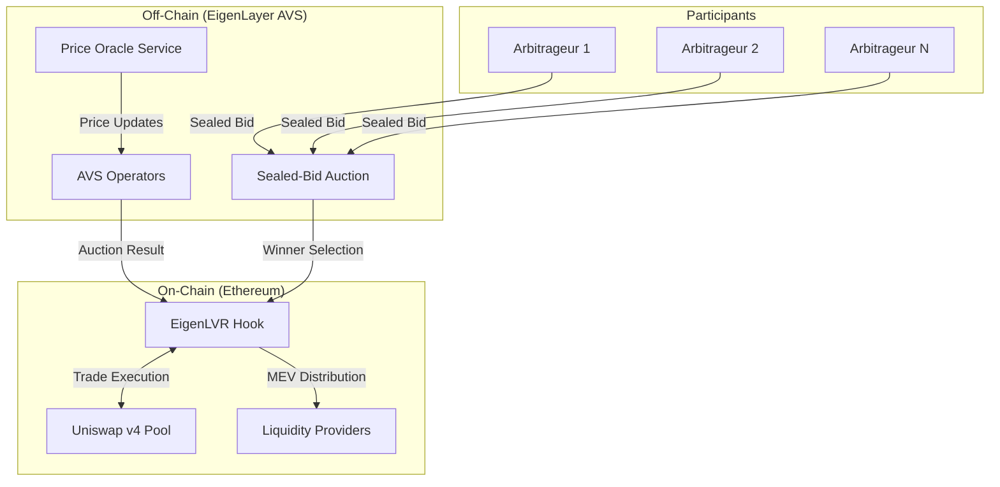

# 🔗 EigenLVR: A Uniswap v4 Hook to Mitigate Loss Versus Rebalancing (LVR) via EigenLayer-Powered Auctions

[](https://opensource.org/licenses/MIT)
[](https://getfoundry.sh/)
[](https://eigenlayer.xyz/)

## 🧠 Overview

EigenLVR is a revolutionary Uniswap v4 Hook designed to address **Loss Versus Rebalancing (LVR)** — a critical issue facing liquidity providers (LPs) — by redirecting value lost to arbitrage back to LPs via a sealed-bid auction mechanism secured by EigenLayer.

Traditional AMM designs expose LPs to impermanent loss due to the delay between off-chain price updates and on-chain trading. In this temporal window, arbitrageurs exploit price discrepancies to their advantage, capturing MEV that rightfully belongs to LPs. EigenLVR introduces a **block-level priority auction** — executed and validated off-chain via an EigenLayer-secured AVS (Actively Validated Service) — that auctions off the first trade of each block and redistributes MEV revenue directly to LPs.

**🏆 Built for Uniswap v4 Hook Hackathon - Advanced Hook Design / AVS Integration Category**

## 🚨 Problem: Loss Versus Rebalancing (LVR)

### The LVR Challenge
- **Price Lag**: Off-chain prices move continuously (Binance, Coinbase), but on-chain AMMs only update when transactions occur
- **Arbitrage Window**: ~13-second block times on Ethereum create profitable arbitrage opportunities
- **Value Extraction**: Arbitrageurs rebalance pools to match external prices, capturing profits that should belong to LPs
- **LP Losses**: Current MEV is captured by searchers, block builders, or validators — not the LPs providing liquidity

### Real-World Impact
```
Example: ETH/USDC Pool
┌─────────────────────────────────────────────────────────────┐
│ Off-chain Price (Binance): $3,000 → $3,050 (1.67% increase) │
│ On-chain Pool Price: Still $3,000 (no trades yet)           │
│ Arbitrage Opportunity: Buy ETH cheap on-chain, sell high    │
│ LP Loss: ~0.83% of notional value captured by arbitrageur   │
└─────────────────────────────────────────────────────────────┘
```

## ✅ Solution: Block-Level Auctions via EigenLayer AVS

### Core Innovation
EigenLVR Hook enables **sealed-bid auctions** for the first trade of each block, fundamentally changing MEV distribution:

1. **Auction Mechanism**: Sealed-bid auction determines who can submit the first profitable trade
2. **Revenue Redistribution**: Bid proceeds flow directly to LPs instead of external parties
3. **EigenLayer Security**: AVS operators validate auction fairness with slashing guarantees
4. **Gas Efficiency**: Off-chain auction computation minimizes on-chain overhead

### Architecture Overview

```mermaid
graph TB
    subgraph "Off-Chain (EigenLayer AVS)"
        AVS[AVS Operators]
        AUCTION[Sealed-Bid Auction]
        ORACLE[Price Oracle Service]
    end
    
    subgraph "On-Chain (Ethereum)"
        HOOK[EigenLVR Hook]
        POOL[Uniswap v4 Pool]
        LP[Liquidity Providers]
    end
    
    subgraph "Participants"
        ARB1[Arbitrageur 1]
        ARB2[Arbitrageur 2]
        ARB3[Arbitrageur N]
    end
    
    ORACLE -->|Price Updates| AVS
    ARB1 -->|Sealed Bid| AUCTION
    ARB2 -->|Sealed Bid| AUCTION
    ARB3 -->|Sealed Bid| AUCTION
    
    AVS -->|Auction Result| HOOK
    AUCTION -->|Winner Selection| HOOK
    HOOK -->|MEV Distribution| LP
    HOOK <-->|Trade Execution| POOL
```

## 🏗️ Technical Architecture

### 1. Smart Contract Layer

#### EigenLVR Hook Contract (`EigenLVRHook.sol`)
- **Uniswap v4 Hook Implementation**: Integrates with pool lifecycle events
- **Auction State Management**: Tracks active auctions and bid submissions
- **MEV Distribution**: Automatically distributes auction proceeds to LPs
- **Access Control**: Ensures only authorized AVS operators can execute auctions

#### Key Functions:
```solidity
function beforeSwap(PoolKey calldata key, IPoolManager.SwapParams calldata params) 
    external override returns (bytes4);

function afterSwap(PoolKey calldata key, IPoolManager.SwapParams calldata params) 
    external override returns (bytes4);

function submitAuctionResult(bytes32 auctionId, address winner, uint256 winningBid) 
    external onlyAVS;

function distributeMEVToLPs(PoolKey calldata key, uint256 amount) 
    external;
```

### 2. EigenLayer AVS Integration

#### AVS Operator Network
- **Decentralized Validation**: Multiple operators validate auction results
- **Slashing Conditions**: Operators risk stake for honest behavior
- **Consensus Mechanism**: Byzantine fault-tolerant auction validation
- **Economic Security**: Aligned incentives through restaking

#### AVS Components:
```
eigenlvr-avs/
├── operator/           # AVS operator node implementation
├── contracts/         # AVS smart contracts
├── service-manager/   # Coordination and slashing logic  
├── task-executor/     # Auction execution engine
└── aggregator/        # Result aggregation and validation
```

### 3. Auction Mechanism

#### Sealed-Bid Dutch Auction
- **Privacy**: Bids remain sealed until auction conclusion
- **Price Discovery**: Efficient market-based MEV pricing
- **Time-Bounded**: Sub-block timing for minimal latency
- **Fair Access**: Equal opportunity for all qualified arbitrageurs

#### Auction Flow:
```
1. Price Deviation Detected → Auction Trigger
2. Arbitrageurs Submit Sealed Bids → AVS Collection
3. AVS Operators Validate Bids → Consensus Process
4. Winner Selection & Verification → Smart Contract Execution
5. MEV Distribution to LPs → Automated Payout
```

## 📊 Economic Model

### Revenue Distribution
```
Total Auction Proceeds (100%)
├── Liquidity Providers (85%)    # Primary beneficiaries
├── AVS Operators (10%)          # Validation incentives  
├── Protocol Fee (3%)            # Development & maintenance
└── Gas Compensation (2%)        # Transaction costs
```

### LP Benefit Calculation
```solidity
// Simplified LP reward calculation
uint256 lpShare = (userLiquidity * auctionProceeds * 85) / (totalLiquidity * 100);
```

## 🚀 Getting Started

### Prerequisites
- [Foundry](https://getfoundry.sh/) for smart contract development
- [Node.js](https://nodejs.org/) v18+ for frontend development
- [Go](https://golang.org/) v1.19+ for AVS operator
- [Docker](https://docker.com/) for containerized deployment

### Installation

```bash
# Clone the repository
git clone https://github.com/your-org/eigenlvr.git
cd eigenlvr

# Install smart contract dependencies
forge install

# Install frontend dependencies
cd frontend && yarn install

# Install AVS dependencies
cd ../avs && go mod download
```

### Quick Start

1. **Deploy Hook Contract**:
```bash
# Deploy to local testnet
forge script script/DeployEigenLVR.s.sol --rpc-url localhost --broadcast

# Deploy to Sepolia testnet
forge script script/DeployEigenLVR.s.sol --rpc-url sepolia --broadcast --verify
```

2. **Start AVS Operator**:
```bash
cd avs
go run cmd/operator/main.go --config config/operator.yaml
```

3. **Launch Frontend**:
```bash
cd frontend
yarn start
# Access dashboard at http://localhost:3000
```

## 🧪 Testing

### Smart Contract Tests
```bash
# Run all tests
forge test

# Run with gas reporting
forge test --gas-report

# Run specific test suite
forge test --match-contract EigenLVRHookTest
```

### AVS Integration Tests
```bash
cd avs
go test ./... -v
```

### Frontend Tests
```bash
cd frontend
yarn test
```

## 📁 Project Structure

```
eigenlvr/
├── contracts/              # Smart contracts (Foundry)
│   ├── src/
│   │   ├── EigenLVRHook.sol
│   │   ├── interfaces/
│   │   └── libraries/
│   ├── test/
│   ├── script/
│   └── foundry.toml
├── avs/                   # EigenLayer AVS
│   ├── operator/          # Operator node
│   ├── aggregator/        # Result aggregation
│   ├── contracts/         # AVS contracts
│   └── cmd/
├── frontend/              # React dashboard
│   ├── src/
│   │   ├── components/
│   │   ├── hooks/
│   │   ├── services/
│   │   └── utils/
│   └── public/
├── backend/               # FastAPI backend
│   ├── server.py
│   ├── services/
│   └── models/
├── docs/                  # Documentation
├── scripts/               # Utility scripts
└── README.md
```

## 🔧 Configuration

### Environment Variables

#### Smart Contracts (`.env`)
```bash
# Network Configuration
SEPOLIA_RPC_URL=https://sepolia.infura.io/v3/YOUR_KEY
MAINNET_RPC_URL=https://mainnet.infura.io/v3/YOUR_KEY
PRIVATE_KEY=0x...

# Contract Addresses
POOL_MANAGER_ADDRESS=0x...
EIGENLVR_HOOK_ADDRESS=0x...

# EigenLayer Configuration
AVS_DIRECTORY_ADDRESS=0x...
DELEGATION_MANAGER_ADDRESS=0x...
```

#### AVS Operator (`config/operator.yaml`)
```yaml
operator:
  address: "0x..."
  private_key_path: "/path/to/keystore"
  
eigenlayer:
  rpc_url: "https://ethereum-rpc.publicnode.com"
  avs_directory: "0x..."
  
auction:
  min_bid: "1000000000000000"  # 0.001 ETH
  max_duration: "10s"
  price_oracle: "chainlink"
```

## 📈 Monitoring & Analytics

### Key Metrics
- **LVR Reduction**: Percentage decrease in LP losses
- **Auction Participation**: Number of active bidders
- **MEV Recovery**: Total value redirected to LPs
- **Gas Efficiency**: Transaction cost optimization
- **Uptime**: AVS operator reliability

### Dashboard Features
- Real-time auction monitoring
- LP reward tracking
- Pool performance metrics
- Historical analytics
- AVS operator status

## 🔒 Security Considerations

### Smart Contract Security
- **Reentrancy Protection**: ReentrancyGuard on critical functions
- **Access Controls**: Role-based permissions via OpenZeppelin
- **Integer Overflow**: SafeMath for arithmetic operations
- **Front-running Protection**: Commit-reveal scheme for sensitive operations

### AVS Security Model
- **Slashing Conditions**: Economic penalties for malicious behavior
- **Consensus Threshold**: Require majority operator agreement
- **Operator Registration**: KYC/AML compliance for professional operators
- **Dispute Resolution**: Challenge period for auction results

### Audit Status
- [ ] Initial internal audit completed
- [ ] Third-party security audit (Trail of Bits)
- [ ] Bug bounty program launched
- [ ] Formal verification of critical functions

## 🚀 Deployment Guide

### Testnet Deployment

1. **Sepolia Testnet**:
```bash
# Deploy hook
forge script script/DeployEigenLVR.s.sol \
  --rpc-url $SEPOLIA_RPC_URL \
  --broadcast \
  --verify

# Register with Uniswap v4
cast send $POOL_MANAGER_ADDRESS "initialize(address,uint24)" \
  $EIGENLVR_HOOK_ADDRESS 3000
```

2. **AVS Registration**:
```bash
# Register AVS with EigenLayer
cd avs
go run cmd/cli/main.go register-avs \
  --config config/testnet.yaml \
  --operator-keystore /path/to/keystore
```

### Mainnet Deployment

1. **Prerequisites**:
   - [ ] Complete security audits
   - [ ] Testnet validation
   - [ ] Community review
   - [ ] Economic parameter finalization

2. **Deployment Checklist**:
   - [ ] Deploy hook contract with timelock
   - [ ] Register AVS operators
   - [ ] Initialize pool integrations
   - [ ] Launch monitoring systems
   - [ ] Enable emergency pause mechanisms

## 🤝 Contributing

We welcome contributions from the community! Please see [CONTRIBUTING.md](CONTRIBUTING.md) for guidelines.

### Development Workflow
1. Fork the repository
2. Create feature branch (`git checkout -b feature/amazing-feature`)
3. Make changes and add tests
4. Ensure all tests pass (`forge test && go test ./...`)
5. Commit changes (`git commit -m 'Add amazing feature'`)
6. Push to branch (`git push origin feature/amazing-feature`)
7. Open Pull Request

### Code Standards
- **Solidity**: Follow [Solidity Style Guide](https://docs.soliditylang.org/en/latest/style-guide.html)
- **Go**: Use `gofmt` and `golint`
- **JavaScript/React**: ESLint + Prettier configuration
- **Documentation**: Update relevant docs with changes

## 📋 Roadmap

### Phase 1: Core Implementation (Q2 2024) ✅
- [x] Uniswap v4 Hook development
- [x] Basic auction mechanism
- [x] EigenLayer AVS integration
- [x] Initial frontend dashboard

### Phase 2: Advanced Features (Q3 2024)
- [ ] Multi-pool support
- [ ] Advanced auction strategies
- [ ] Cross-chain compatibility
- [ ] Enhanced analytics

### Phase 3: Production Release (Q4 2024)
- [ ] Mainnet deployment
- [ ] Professional operator network
- [ ] Institutional partnerships
- [ ] Governance token launch

### Phase 4: Ecosystem Expansion (2025)
- [ ] Additional DEX integrations
- [ ] Layer 2 deployments
- [ ] Advanced MEV strategies
- [ ] DAO governance transition

## 📄 License

This project is licensed under the MIT License - see the [LICENSE](LICENSE) file for details.

## 🙏 Acknowledgments

- **Uniswap Labs** for the revolutionary v4 architecture
- **EigenLayer** for restaking infrastructure and AVS framework
- **Paradigm** for LVR research and economic modeling
- **Flashbots** for MEV awareness and tooling
- **OpenZeppelin** for secure smart contract libraries

## 📞 Contact & Support

- **Documentation**: [docs.eigenlvr.com](https://docs.eigenlvr.com)
- **Discord**: [discord.gg/eigenlvr](https://discord.gg/eigenlvr)
- **Twitter**: [@EigenLVR](https://twitter.com/EigenLVR)
- **Email**: team@eigenlvr.com

---

**⚠️ Disclaimer**: This is experimental software. Use at your own risk. Past performance does not guarantee future results. Please conduct your own research before interacting with smart contracts.
